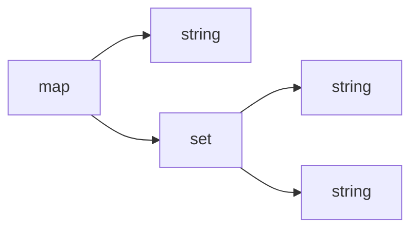

# 🚀 Система учета дружеских связей  

## 📝 Описание проекта

Программа реализует автоматизированную систему учета дружеских связей между пользователями.

**Поддерживает три основные операции:**

- Добавление дружбы между двумя пользователями
- Подсчет количества друзей пользователя
- Проверка наличия дружбы между пользователями

## ⚙️ Технические особенности

- **Использует комбинацию контейнеров STL:** `map` и `set`
- Эффективные операции за `O(log n)`
- Автоматическая обработка новых пользователей
- Защита от дублирования связей

## 🛠️ Компиляция и запуск

```bash
# Компиляция
g++ -std=c++11 friend_system.cpp -o friend_system

# Запуск (интерактивный режим)
./friend_system

# Запуск с входным файлом
./friend_system < input.txt
```  

## ⌨️ Поддерживаемые команды

| Команда | Формат | Описание |  
|---------|--------|----------|  
| `FRIENDS` | `FRIENDS <user1> <user2>` | Устанавливает дружбу между пользователями |  
| `COUNT` | `COUNT <user>` | Возвращает количество друзей пользователя |  
| `QUESTION` | `QUESTION <user1> <user2>` | Проверяет наличие дружбы (YES/NO) |  

## 📋 Пример использования

### Входные данные

```bash
8
FRIENDS Peter Goward
COUNT Sally
FRIENDS Goward Sally
COUNT Goward
COUNT Peter
QUESTION Goward Peter
QUESTION Peter Sally
QUESTION Jenny Justin
```

### Вывод программы

```bash
0
2
1
YES
NO
NO
```

## 🧪 Тестовые сценарии

1. **Базовый тест** - проверка работы из примера задания
2. **Дублирование связей** - повторное добавление одинаковой дружбы
3. **Симметричность** - проверка двусторонней дружбы
4. **Отсутствующие пользователи** - запросы по несуществующим пользователям
5. **Множественные связи** - обработка пользователей с большим числом друзей

## 📊 Структура данных



- **Ключ map**: имя пользователя (string)
- **Значение map**: множество друзей (set<string>)

## Особенности реализации

- Для хранения связей используется `map<string, set<string>>`
- Гарантируется уникальность связей через контейнер `set`
- Проверка дружбы выполняется за `O(log n)`
- Автоматическая обработка новых пользователей

---

- `Преподаватель`: **Дуплей Максим Игоревич**
- `Telegram`: [@quadd4rv1n7](https://t.me/quadd4rv1n7)
- `Дата разработки`: 28.05.2025

> Проект выполнен в рамках задания 5.4 «Комбинация контейнеров».
